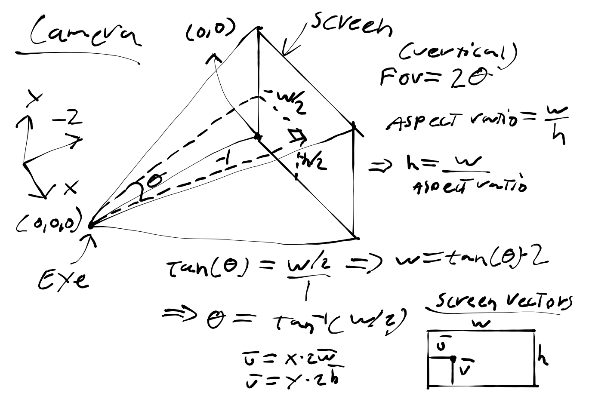
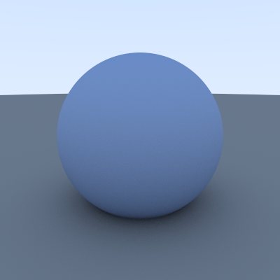
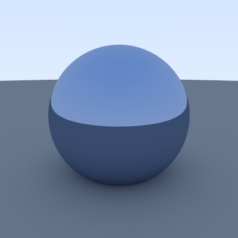
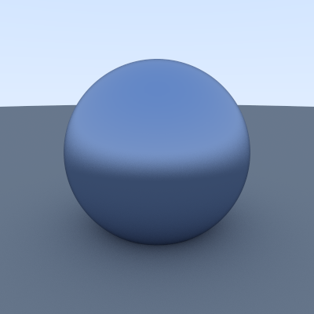
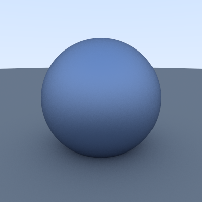
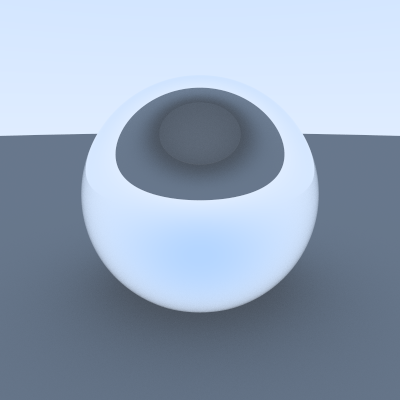
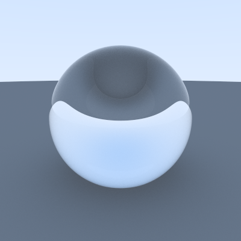
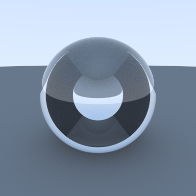

# Project Implementation

## What is Raytracing?

### In the real world
To oversimplify, light in real world travels from light source (sun, light bulb)
to the observers eye. When light ray hits eye, different wavelengths are perceived 
as different colors. When light bounces from objects its wavelength is changed 
since some of its energy is absorbed. Energy of a photon depends on the wavelenth. 


where h is [Plancks constant](https://en.wikipedia.org/wiki/Planck_constant), c is [speed of light](https://en.wikipedia.org/wiki/Speed_of_light) and lambda being the wavelength.

### In raytracing

In raytracing the light rays are sent from the eye to the light source. 
In the algorithm the _camera_ represents the eye. The light rays traverse 
the world backwards (eye -> light source) and not like in the real world (light source -> eye). 
The "real world" model is computationally not optimal since most of the light rays 
wouldn't even hit the camera. 

Wikipedia page about raytracing demonstrates the general idea. Note that the (Blinn-Phong)
model is not implemented in this project. Area lights are not implemented either. When ray 
hits "void" (0 solutions), it's considered that it hits "sky" and color is computed accordinly. 


## Overview
Technically the implemented algorithm corresponds more closely to [path tracer](https://en.wikipedia.org/wiki/Path_tracing) than [ray tracers](https://en.wikipedia.org/wiki/Ray_tracing_(graphics)). The main difference is that path tracing uses 
random sampling and ray tracing does not. Path tracer will 
produce noise when used with low sample count. The more samples are used the more accurate (less noisy) the final output will be. This type of approach is often referred as the [Monte Carlo method](https://en.wikipedia.org/wiki/Monte_Carlo_method).

The project is done without any external dependencies (excluding googletests and openMP). 

## Classes

### Vector3D

Vector3D class contains data structure for 3 dimensional euclidean and 
RGB vectors. This includes arithmetic operations between Vector3D objects. 
The whole vector class is inlined to improve performance. Majority of the 
operations done by the algorithm are done using vectors. Hence these 
are called millions of times in a short timespan. Therefore operation call
overhead causes significant impact. 

### Ray

The ray class handles mapping between two Vector3D vectors. These two vectors 
are named origin and direction. While regular euclidean vectors have length 
and direction. The ray has position, length and direction. The ray class has 
member function to return arbitrary point along it's span. This feature is used to solve the hit equation or ray intersection equation. 

### Camera

The camera consist of eye and screen. Rays 
are traversed from eye to screen and then out 
to the world. The screen corresponds to the 
rendered image. Each pixel on the screen is mapped to a ray which intersects the eye and the pixel it's called from.


The sketch shows how the trigonometric formulas used in the implementation are derived. 

### Engine

The engine class is used to do the actual rendering process. The _screen_
(in camera sketch) is traversed with nested for loops. The parallelization 
is done by splitting the nested for loop into segments (rectangles on screen) and assigning each segment to a separate thread. Each thread processes then 
pixels on it's own segment in parallel. Implementing the paralellization this 
way causes no critical sections in the code. Library called openMP is used to 
do the parallelization. 

Each pixel inside each segment is mapped to a ray and then the ray is send out to the world to see how it bounces from different objects. Color for each pixel is 
computed based on these bounces. This mapping is done multiple times 
using slight variation in (x,y) screen coordinate and then the 
color from these _samples_ is averaged. This is called random [supersampling](https://en.wikipedia.org/wiki/Supersampling). The idea is to remove jagged edges from the 
final image. 

Now these samples are also used to produce scatter rays. Rays can 
be set to bounce in random directions or set to bounce by probability distribution. Meaning rays will bounce differently on each sample. This is helpful when trying to simulate [global illumination](https://en.wikipedia.org/wiki/Global_illumination). When probability distribution is used to distribute light the term [Monte Carlo Path tracing](https://en.wikipedia.org/wiki/Path_tracing) or just path tracing is used instead of raytracing.

Downside of this method is that the final image is usually noisy. Increasing sample 
count can be used to combat this issue but with diminishing returns. Another popular method to combat this is to use denoise algorithm which isn't implemented in this project. 

### Primitives


#### Abstract primitive

Abstract primitive class or just Primitive class 
provides interface for all "primitives". Primitives are objects in the world which cannot be divided into smaller pieces e.g triangles, polygons or spheres. All of 
the classes which inherit this class must have "hit" member function. Hit member 
function solves the hit equation or ray intersection equation. The hit equation for is 
different for each primitive. 

#### Primitivelist

Primitivelist is data structure for keeping track of all objects in the world. 
This inherits the abstract primitive class, meaning Primitivelist has hit()
member function. When this member function is called, all of the objects in 
this list are tested against ray r (given as parameted in hit()) and the 
closest hit to the camera is returned. 

#### Sphere

Sphere class defines the sphere primitive. This inherits the abstract primitive 
class. The hit equation for the sphere is formulated using vectors

### Materials

#### Abstract material 

Abstract material class works similarly to abstract primitive class. This defines 
interface for all materials in the world. All materials have scatter() member function 
which determines direction for a ray when it bounces from surface with this material. 
Note that some materials can let ray to pass through surface. 
Materials and primitives are closely linked since computing a scatter/bounce ray 
requires information about the surface it hits and the material. 

#### Lambertian

Lambertian material is diffusively reflecting or "matte" material. 
Rays are reflected to random directions. The real mathematical 
representation of _Lambertian_ does not scatter rays by random 
hence this implementation is only a approximation. 



The image is rendered at 400x400, 1000 samples.

Render time on Ryzen 9 3900x (24 threads) is 3.5 seconds


#### Metal

Metal material is highly reflective material. Rays are mirrored 
using surface normal as axis of symmetry. Blur can be added to 
reflections by adding slight random variation to the reflecting 
ray. Rendering following images at 400x400, 1000 samples and with 
Ryzen 9 3900x.

blur 0, render time 2.7 s                     |  blur 0.3, render time  3.0 s                 | blur 0.9, render time 3.0 s                  |
:-------------------------:|:-------------------------:|:-------------------------:|
 | |  |

Render time slightly increases when blur != 0 since random generator is used to 
produce the blurriness.


#### Dielectric

Dielectric material allows rays to pass through surfaces. [Snell's law](https://en.wikipedia.org/wiki/Snell%27s_law) is used to compute the refraction angle. Usually 
Snell's law is represented in form:


Since rays are computed using vectors, the vector form is used instead:


r is index of refraction (ior), c is dot product of normal and ray vector l. The Snell's 
law is combined with Fresnel effect which is usually described with [Fresnel equations](https://en.wikipedia.org/wiki/Fresnel_equations). Instead of these equations a 
[approximation](https://en.wikipedia.org/wiki/Schlick%27s_approximation) by Christophe Schlick is used. This is by far the most complicated material the renderer supports. 
The dielectric material has one parameter which is ior ([index of refraction](https://en.wikipedia.org/wiki/Refractive_index)). 


ior 1.0 (vacuum), render time 3.5 s                     |  ior 1.33 (water), render time  3.7 s                 | ior 2.65 ([moissanite](https://en.wikipedia.org/wiki/Moissanite)), render time 13.3 s                  |
:-------------------------:|:-------------------------:|:-------------------------:|
 | |  |


## Functions

### Recursive scatter

The function recursiveScatter() handles the recursive calling of the scatter() member function 
which is defined by all material classes. The recursiveScatter function is:

```C++
Vector3D recursiveScatter(const Ray &r, Primitive *world, int depth, function<float()> &randomFloat,
                          const int depthlimit) {
    hitrecord record;

    const float floaterror = 0.001;

    if (world->hit(r, floaterror, numeric_limits<float>::max(), record)) {

        Ray scatter;
        Vector3D attenuation;

        if (depth < depthlimit && record.matptr->scatter(r, record, attenuation, scatter, randomFloat)) {
            return attenuation * recursiveScatter(scatter, world, depth + 1, randomFloat, depthlimit);
        } else {
            return Vector3D();
        }
    }
    return skyGradient(r);
}
```

The function is called first time with ray given by the camera. After that it calls recursively itself
on every bounce. The _attenuation_ is used to alter the color after each bounce. This is done with 
simple multiplication as shown in the code. This idea is similiar to photon losing some of its energy 
after it bounces from objects (as described in the very beginning of this document). 

## Sources

[Ray tracing (graphics), wikipedia](https://en.wikipedia.org/wiki/Ray_tracing_(graphics))

[Path Tracing, wikipedia](https://en.wikipedia.org/wiki/Path_tracing)

[Bounding volume hierarchy, wikipedia](https://en.wikipedia.org/wiki/Bounding_volume_hierarchy)

[Monte Carlo method](https://en.wikipedia.org/wiki/Monte_Carlo_method)

[Möller-trumbore intersection algorithm, wikipedia](https://en.wikipedia.org/wiki/M%C3%B6ller%E2%80%93Trumbore_intersection_algorithm)

[Cost Analysis of a Ray Tracing algorithm, Bruce Walter and Peter Shirley, July 23, 1997](https://www.graphics.cornell.edu/~bjw/mca.pdf)

[Ray Tracing In One Weekend - The Book Series, Peter Shirley](https://raytracing.github.io/)

[Snell's law, wikipedia ](https://en.wikipedia.org/wiki/Snell%27s_law)

[Schlick's approximation, wikipedia](https://en.wikipedia.org/wiki/Schlick%27s_approximation)

[Moissanite, wikipedia](https://en.wikipedia.org/wiki/Moissanite)

[Refractive index, wikipedia](https://en.wikipedia.org/wiki/Refractive_index)