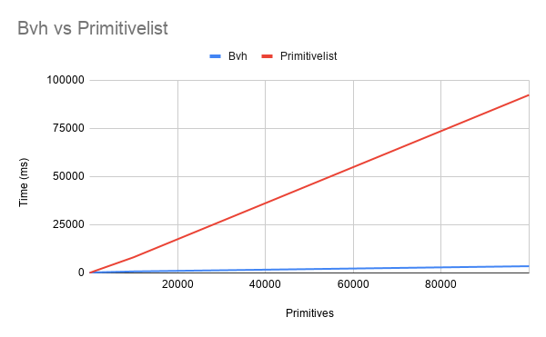

# Project Testing

## Unit testing 

Unit testing is done with [googletest](https://github.com/google/googletest) and project is automatically build and tested at [Travis CI](https://travis-ci.org/). Test coverage reports are generated with gcc (using -coverage flag). After testing has finished the reports are uploaded to [codecov.io](https://codecov.io/) from Travis. 

Unit tests that are currently implemented are 
straight forward. Most of them use pre-calculated 
values which are then compared against the code.

### EngineTest

A simple test scene is rendered using 2 spheres. then some of the pixels are read from the output file and checked if they are in 
certain color range. 

### Vector3DTest

Vector operations are tested with pre-calculated values. If vector operations work with these simple test cases then it's highly likely 
that they will work with any values. 

### CameraTest

Camera is tested with pre-calculated values. Fov, aspect ratio, origin
and pointAt position are set to predefiend values. Then it is tested 
that camera returns correct rays for center and corners of the screen. 

### Material tests

The materials are tested by checking if they return correct 
scatter rays when scatter() function is called.

### RayTest

RayTest tests  that does pointAtC member function return correct values.

## Performance comparison Bvh vs Primitivelist

As mentioned in the [implementation document](/Documentation/implementation.md#bounding-volume-hierarchy-class-bvhnode), the
time complexity of bvh is O(log(n)) and for primitivelist it is O(n). Now this 
is tested by measuring render times in the demo scene by varying the amount of 
randomly generated spheres. Resolution of 200x100 is used to reduce render times
to more feasible figures. 

A picture of the used demo scene. At the picture the demo has slightly over 1000 spheres. 

