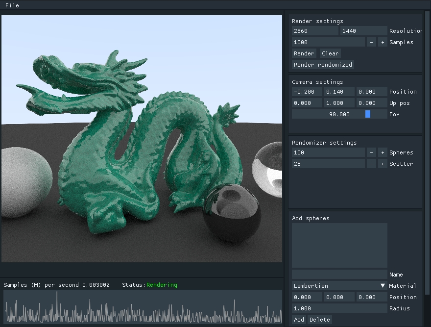
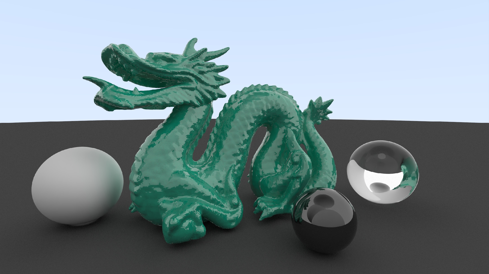

# Raytracer

A Monte Carlo Path Tracer built from scratch.


[](https://codecov.io/gh/Tykky/Raytracer)

## Dependencies
* [googletest](https://github.com/google/googletest) (via git submodule)
* [glfw](https://github.com/glfw/glfw) (via git submodule)
* [glew](https://github.com/nigels-com/glew) (via git submodule)
* OpenMP
* OpenGL

## How to build
````
git clone https://github.com/Tykky/Raytracer --recursive
cd Raytracer
mkdir build
cd build
cmake -DCMAKE_BUILD_TYPE=Release ..
cmake --build . --config release
cd bin
````
## Run after building
```
./raytracer
```

## Current state of the project


3D-models in .obj file format are now supported.

### **Note** 

Download [dragon.obj](http://tykky.github.io/dragon.obj) and place 
it in the same directory as the executable. Otherwise, the program won't run. 
This will be fixed soon so that the GUI has a button for importing 3D models.
Also note that you'll need to adjust camera position to (-0.2, 0.14, 0.0) to 
be able to see anything sensible. The original 3D model is from 
[The Stanford 3D Scanning Repository](http://graphics.stanford.edu/data/3Dscanrep/).


## Gallery




