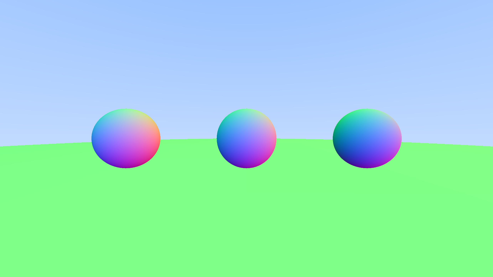

# Raytracer

This repository contains a raytracer for University of Helsinki's course Data Structures Project.

## Documentation

[Project Specification](./Documentation/specification.md)

[Timesheet](./Documentation/timesheet.md)

## Weekly reports

* [Week 1](./Documentation/reports/week1.md)
* [Week 2](./Documentation/reports/week2.md)
* [Week 3](./Documentation/reports/week3.md)

## Current state of the project

Surface normals are mapped to RGB color. At the current stage the renderer lacks proper shading. The latest additions are:

- Basic shading with surface normals mapped to color.
- Virtual camera with adjustable fov.
- Sphere primitives.

