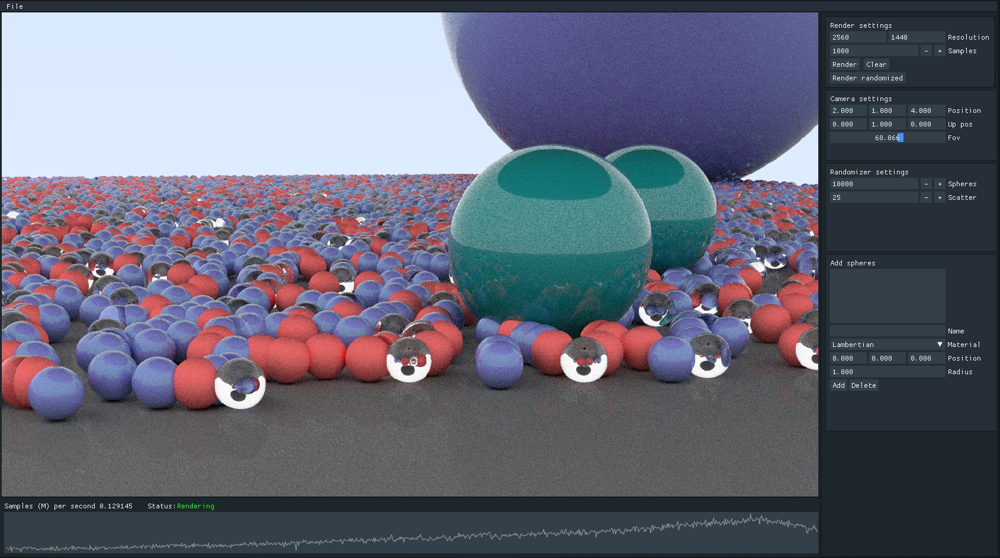

# Raytracer

A Monte Carlo Path Tracer built from scratch.


[](https://codecov.io/gh/Tykky/Raytracer)

## Dependencies
* [googletest](https://github.com/google/googletest) (via git submodule)
* [glfw](https://github.com/glfw/glfw) (via git submodule)
* [glew](https://github.com/nigels-com/glew) (via git submodule)
* OpenMP
* OpenGL

## How to build
````
git clone https://github.com/Tykky/Raytracer --recursive
cd Raytracer
mkdir build
cd build
cmake ..
cmake --build . --config release
cd bin
````
## Run after building
```
./raytracer
```

## Current state of the project

Gui implemented with OpenGL + Dear ImGui features real-time render preview and tools for measuring performance

## Gallery


