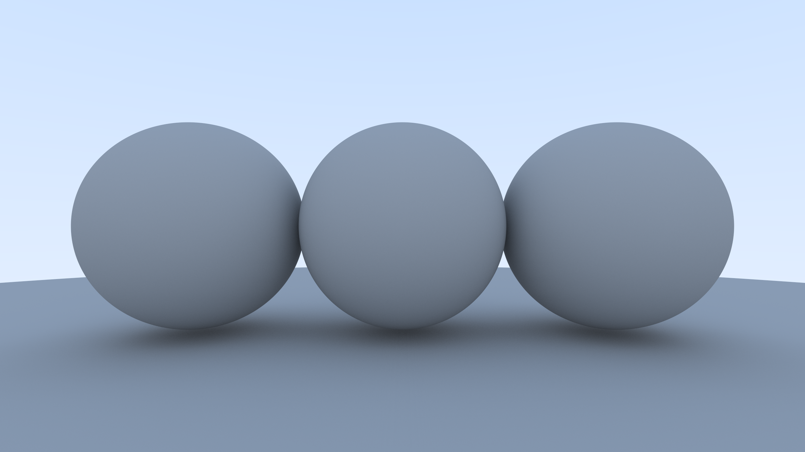

# Raytracer


This repository contains a raytracer for University of Helsinki's course Data Structures Project.

[](https://travis-ci.org/Tykky/Raytracer)
[](https://codecov.io/gh/Tykky/Raytracer)
## Documentation

[Project Specification](./Documentation/specification.md)

[Timesheet](./Documentation/timesheet.md)

## Weekly reports

* [Week 1](./Documentation/reports/week1.md)
* [Week 2](./Documentation/reports/week2.md)
* [Week 3](./Documentation/reports/week3.md)
* [Week 4](./Documentation/reports/week4.md)

## How to build on linux
```
git clone --recursive https://github.com/Tykky/Raytracer
cd Raytracer
mkdir build
cd build
cmake ..
make
```
After building the program can be run with:
```
./Source/raytracer
```
Tests can be run with:
```
./Test/gtest_run
```

The project shouldn't have any operating system specific dependencies. This should be compilable on windows (not tested). To be able to build you need:

- cmake 3.12.4 (or newer)
- gcc (9.2 preferably)

## Command-line interface

The program prompts user to enter 

- screen width (image width in pixels)
- screen height (image height in pixels)
- fov (vertical field of view in degrees)
- samples (number of times each pixel is sampled)


After rendering is finished, the program should output image to 
the current directory (the same one where program is run).

## Current state of the project


[Lambertian reflectance](https://en.wikipedia.org/wiki/Lambertian_reflectance) is achieved by approximating [Lambert's cosine law](https://en.wikipedia.org/wiki/Lambert%27s_cosine_law) by sampling random inside unit sphere with [Mersenne Twister](https://en.wikipedia.org/wiki/Mersenne_Twister). Sampling is also used for [anti-aliasing](https://en.wikipedia.org/wiki/Anti-aliasing). The latest additions are:

- Recursive ray scattering
- support for multithreading with openMP
- Lambertian material
- Minimal command-line interface
